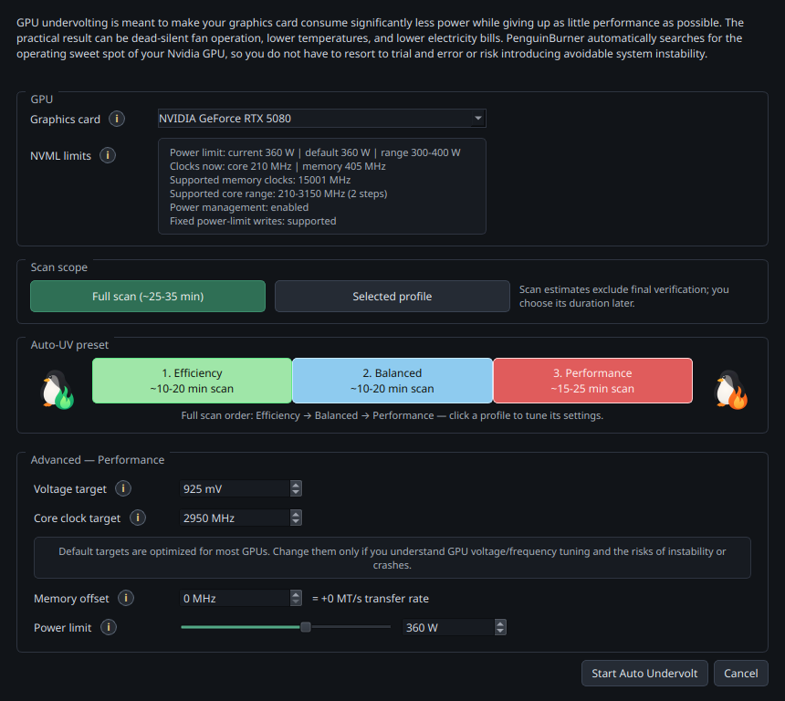

#  PenguinBurner — Automatic NVIDIA GPU Undervolting & Overclocking for Linux

<p align="center">
  <a href="https://pypi.org/project/penguin-burner/"></a>
  <a href="https://pypi.org/project/penguin-burner/"></a>
  
  
  <a href="LICENSE"></a>
  <a href="https://github.com/sponsors/jpietek"></a>
  <a href="https://github.com/jpietek/PenguinBurner/stargazers"></a>
</p>
<p align="center">
  
  
  
  
  <a href="https://pepy.tech/project/penguin-burner"></a>
</p>


PenguinBurner is an open-source NVIDIA GPU tuning app for Linux with
automatic undervolting & overclocking with adaptive per-game tuning targets.

**One scan. Three verified GPU profiles.**

- **Efficiency** — deepest savings. RTX 5080: 850 mV · 2800 MHz target /
  2625 MHz loaded · 254 W.
- **Balanced** — maintain more loaded clock. RTX 5080: 860 mV · 2775 MHz
  target / 2745 MHz loaded · 272 W.
- **Performance** — undervolt and overclock. RTX 5080: 925 mV · 2950 MHz
  target / 2977 MHz loaded · 313 W.

For scale: the same RTX 5080 at stock uses about **341 W** under the same load.
Balanced held roughly the same loaded clock at 272 W — about 69 W less.

Verified RTX 5080 examples; every GPU differs. A requested target can exceed
the loaded clock when voltage droop or the power governor intervenes.
Pre-optimized targets are included for RTX 30, 40, and 50 series cards.

## Install

```bash
python -m pip install --user --upgrade penguin-burner
```

On distros whose system Python is externally managed (Fedora 38+,
Ubuntu 23.04+, Debian 12+), pip refuses with `externally-managed-environment`;
use `pipx install penguin-burner` there — or a native package below.

Also packaged for [Fedora (COPR)](https://copr.fedorainfracloud.org/coprs/jpietek/penguin-burner/),
[Arch / CachyOS (AUR)](https://aur.archlinux.org/packages/penguin-burner), and
[Ubuntu (PPA)](https://launchpad.net/~jpietek/+archive/ubuntu/penguin-burner) —
commands in the [Install guide](docs/install.md).

A [Flatpak](https://github.com/jpietek/PenguinBurner/releases/latest) is
available from the
[PenguinBurner Flatpak repository](https://jpietek.github.io/PenguinBurner/penguin-burner.flatpakrepo),
but a native install (pip / COPR / AUR / PPA) is strongly recommended over it:
Steam launches, the in-game overlay's Vulkan layer, and the root daemon all
live on the host, so the Flatpak must write and repair host-side files from
inside its sandbox — more moving parts and more that can break. Use the
Flatpak only when nothing else is practical (e.g. immutable distros), with the
[Flatpak install and update guide](docs/flatpak.md).

PyPI, Flatpak with wrappers, COPR, AUR, and PPA installs run the GUI with
`penguin-burner` (or `pburn`). Install the NVIDIA driver and CUDA first.

All privileged GPU work is done by a small root systemd service,
`penguin-burnerd` — a compiled Rust daemon that PenguinBurner installs once
(one admin prompt) the first time you set up hardware control. After that
one-time setup the GUI, CLI, and Auto-UV scans all run as your regular user
and talk to the service over a local socket, with no further password
prompts.

## Quick start

1. Install (above) with the NVIDIA driver and CUDA already set up.
2. Launch PenguinBurner (`penguin-burner` or `pburn`). Flatpak users without
   wrappers should use the [Flatpak guide](docs/flatpak.md).
3. Click **Setup Auto Undervolt**, choose a performance bias, and let the scan
   find and verify a stable curve. When it finishes, the verified profile is
   applied automatically.
4. On the **Profiles** tab you can select any saved profile and click **Apply**
   to switch to it. Tick **Apply on startup** to also make the applied profile
   your boot profile — off by default, so a tuned curve is never re-applied at
   boot unless you opted in. Toggle **Silent fan curve** for the quiet fan
   profile, or **Restore defaults** to return the GPU to stock. Multi-GPU
   systems filter the table with the **Target GPU** selector. On a one-GPU
   system the same selector shows the detected card but is disabled. With two
   or more NVIDIA GPUs, **Main GPU** selects which saved startup card owns
   daemon monitoring after boot; Intel and AMD PRIME adapters do not count.
5. For per-game tuning — including **Adaptive**, which switches tiers as your
   frame rate changes — use the **Steam** tab to pick a mode per game.

## Automatic Undervolting & Overclocking

Tests your card under real load and finds the most efficient stable undervolt
curve for you. The sweep runs PenguinBurner's managed
[headless Q2RTX benchmark](https://github.com/jpietek/Q2RTX-headless)
plus a **CUDA** compute test, with stability and performance checks built in.
If a scan crashes mid-probe, the next run records that voltage/clock band as
unsafe and can resume from saved candidates for the same tier.

During Auto-UV, leave the GPU otherwise idle. Do not run games, renders,
machine-learning jobs, video encoders, miners, or other GPU/VF/VRAM-heavy work
while the scan is progressing. Auto-UV needs the whole card to itself so its
FPS-per-watt and stability measurements reflect the candidate curve, not a
second workload competing for power, clocks, memory bandwidth, or VRAM.


Pick a single bias (Efficiency, Balanced, or Performance), or run **All tiers**
— one pass that discovers and verifies **all three profiles in a single scan**,
sharing the sweep so you get a complete Efficiency/Balanced/Performance set (the
green/blue/red curves above) ready for adaptive switching without three separate
runs.

You can also set a GPU board power limit for the scan; PenguinBurner reads the
selected card's NVML power-limit range, applies the cap during Auto-UV, and
saves it with the final profile so runtime/profile application restores it.
On laptop GPUs with a fixed board power limit the control is grayed out and
scans run at the stock limit automatically.



[Read the guide](docs/features/auto-uv.md)

## Adaptive Undervolting

Tag your saved profiles as **Efficiency**, **Balanced**, or **Performance**, and
PenguinBurner switches between them while you play: efficient and silent when you
have headroom, more clock when frames start to drop. It also recognises when the
frame rate is held by something clocks can't move — a 60 FPS menu, vsync, an
in-game limiter — and eases the tier down instead of burning power against the
cap, and does the same when the desktop sits idle after a game.


[Read the guide](docs/features/adaptive-uv.md) — including
[every tuning knob and environment variable](docs/features/adaptive-uv.md#one-word-tuning-responsiveness).

## Steam Integration

PenguinBurner discovers your installed Steam library and makes undervolting
**per-game**. Pick a mode for each game — Adaptive, a fixed tier, or Stock — and
PenguinBurner applies it automatically when the game launches and restores your
standing profile when it exits, with no password prompt.


Steam integration is what unlocks the fully customizable, **per-game** setup:

- **Per-game profiles** — a different GPU behavior saved for each game.
- **Per-game GPU target** — on multi-GPU systems, choose the physical card by
  stable UUID; single-GPU systems keep the selector hidden.
- **Per-game adaptive pre-frame-generation FPS target** — the adaptive engine's
  promote/demote target, set individually per game (a 60 Hz story game and a
  144 Hz shooter each get their own).
- **In-game overlay** and **live launch/stop** from the tab.

These per-game features **require the Steam integration** — they are delivered
through the launch wrapper, so a game must be enabled in the Game Library tab
to get an
adaptive per-game FPS target or the overlay. A one-click **All games** menu can
enable or disable the wrapper across your whole library at once.

[Read the Steam guide](docs/steam.md)

## PenguinBurner vs LACT (NVIDIA)

[LACT](https://github.com/ilya-zlobintsev/LACT) is the broader, more established
Linux GPU app, and it landed a working Nvidia VF curve setter before we did. It
supports more brands and has deeper monitoring than we do. PenguinBurner is
narrower on purpose: automatic undervolting & overclocking, an in-game overlay,
and adaptive switching. NVIDIA-only comparison, to the best of our knowledge:

| Capability (NVIDIA) | PenguinBurner | LACT |
| --- | :---: | :---: |
| **Automatic** undervolt search (stability + perf verified) | ✅ Q2RTX + CUDA sweep | ❌ manual only |
| Rust hardware daemon | ✅ | ✅ |
| **Adaptive** undervolt (switches tiers by frame rate) | ✅ | ❌ |
| **In-game performance overlay** | ✅ | ❌ |
| **PC latency meter** | ✅ | ❌ |
| **Pre-frame-generation FPS counter** (base vs FG FPS) | ✅ | ❌ |
| Manual V/F curve editor | ✅ | ✅ |
| Fan curve control | ✅ auto silent curve + editor | ✅ custom curves |
| Power limit | ✅ Auto-UV + saved profiles | ✅ |
| Steam library import | ✅ auto-discovered library | ❌ |
| Per-game tuning profiles | ✅ per-game mode, adaptive FPS target, live launch | ❌ |
| Runtime profile switching | ✅ by present-frame FPS pacing | ✅ by running process / gamemode |
| MSI Afterburner import | ✅ | ❌ |
| Historical telemetry charts | 🚧 planned (live overlay today) | ✅ charts + CSV export |
| Detailed GPU info (VBIOS / VRAM / Vulkan / throttling) | ❌ tuning-focused | ✅ |
| Other GPU brands (AMD / Intel) | ❌ NVIDIA-native, for now | ✅ AMD · Intel · NVIDIA |
| systemd daemon · CLI / headless | ✅ · ✅ | ✅ · ✅ |

✅ available · ❌ not available · 🚧 planned/in progress

LACT monitors inside its own window (charts and CSV) and has no in-game overlay;
on Linux that is usually a separate tool like MangoHud. PenguinBurner's overlay
is built in.

The two interoperate via LACT export, so you can tune with PenguinBurner and run
the resulting curve under LACT if you prefer.

### Roadmap (planned, not yet shipped)

- **Historical data plotting** — power, clocks, and FPS over time.

## Performance Overlay

A lightweight live on-screen readout over your game. It can visualize **PC
latency** and **pre-frame-generation FPS** — things most Linux overlays can't —
alongside frame-gen FPS, clocks, voltage, power, temperatures, and the active
tier.


Launch the game through the wrapper, then toggle the fields you want:

```text
PENGUIN_BURNER %command%
```

Add the overlay flag when you want the readout visible immediately:

```text
PB_OVERLAY=1 PENGUIN_BURNER %command%
```

In-game latency turns on with the overlay — no extra flag. The NVAPI shim is
deployed into the Proton prefix automatically and streams Reflex markers (it
works under frame generation); native and prefix-less games fall back to the
Vulkan layer's marker tap. Opt out with `PB_INGAME_LATENCY=0`.

Some games do not expose usable latency markers at all. PenguinBurner can load
the telemetry layer and parse marker streams when they exist, but it cannot
force a game engine to emit real input/simulation/present markers. See
[Latency and frame-generation FPS](docs/features/latency-fg.md) for the full
source and fallback model.

Any tuning change you make is reflected live in the overlay while you play, so
you see the effect of an undervolt, clock, or fan change in real time without
leaving the game.

[Read the guide](docs/features/overlay.md) or the
[latency/FG details](docs/features/latency-fg.md).

## More features

- **[Profile management](docs/features/profile-management.md)** — apply, verify,
  tier, export, and clean up saved curves.
- **[Curve editors](docs/features/curve-editor.md)** — Afterburner-style manual
  V/F and fan curve editors with full keyboard control.
- **[Silent fan curve](docs/features/silent-fan-curve.md)** — auto-generated
  quiet fan curve once the undervolt brings temperatures down.

## MSI Afterburner Import

Bring your Windows [MSI Afterburner](https://www.msi.com/Landing/afterburner/graphics-cards)
profile over and import its V/F curve.


Point PenguinBurner at the real MSI Afterburner directory (no Afterburner
binaries or profiles are bundled in this repo). Default Windows path:

```text
C:\Program Files (x86)\MSI Afterburner
```

## LACT Export

Export any saved V/F (and optionally fan) curve as a complete Nvidia LACT config
from the Profiles view. See
[the Auto-UV guide](docs/features/auto-uv.md#after-the-scan) for the workflow.

## Run At Your Own Risk

Auto-UV makes real hardware changes — enabling persistence mode, setting board
power limits, writing core/memory V/F offsets, and taking over fan control.

The **Balanced** and **Efficiency** Auto-UV profiles use conservative voltage
floors; Efficiency also caps board power by default. Efficiency accepts the
deepest loaded-clock drop, then may reclaim stable clock without raising its
proven voltage. Balanced keeps more loaded clock with a higher voltage and
the stock power budget (cap it per scan in the dialog if you want a watts
ceiling too).

**Performance** is the profile that pushes past stock: it undervolts and then
overclocks. On my RTX 5080, during the OC phase I sometimes get a "Vulkan device
lost", which PenguinBurner catches and then reverts the problematic
voltage/frequency point. Worst case is a hard system freeze and reboot — after
which the blacklisted V/F point is persisted to the UV history file in your home
directory, so it is not retried.

You can also define, in the Performance setup dialog, exactly which
voltage/frequency point the card is pushed to over stock limits. The default is
the suggested point for 30/40/50-tier GPUs, based on experiments with this and
similar tools on Windows. Performance is optional anyway — OC is not mandatory.

## Acknowledgements

PenguinBurner was built through agentic AI development, guided by human ideas and
direction. The implementation, research, and reverse engineering were driven
primarily by **GPT 5.5** (OpenAI) and **Claude Opus** (Anthropic), recently
most of the codebase (new Rust daemon!) was rewritten with **Fable** (Anthropic).

- **NVIDIA** — for the graphics technology that, unfortunately, lacks some
  features and polish on Linux.
- **[Qt Project](https://www.qt.io/)** — for the excellent Qt6 UI.

Special thanks to the [LACT project](https://github.com/ilya-zlobintsev/LACT)
and Ilya Zlobintsev for pushing Linux NVIDIA tuning forward — in particular
[LACT #957 (Nvidia VF curve editor)](https://github.com/ilya-zlobintsev/LACT/pull/957),
merged April 18, 2026.

## Support

- [Sponsor the project](https://github.com/sponsors/jpietek)
- [Report a bug](https://github.com/jpietek/PenguinBurner/issues)

## CLI Documentation

The CLI-focused README is archived in [readme-cli.md](readme-cli.md).

## Start clean

Reset PenguinBurner user state for a fresh run:

```bash
rm -rf ~/.config/PenguinBurner ~/.local/share/PenguinBurner ~/.cache/PenguinBurner
```

Installing from a local checkout? See the [Install guide](docs/install.md#local-wheel-from-a-checkout).
