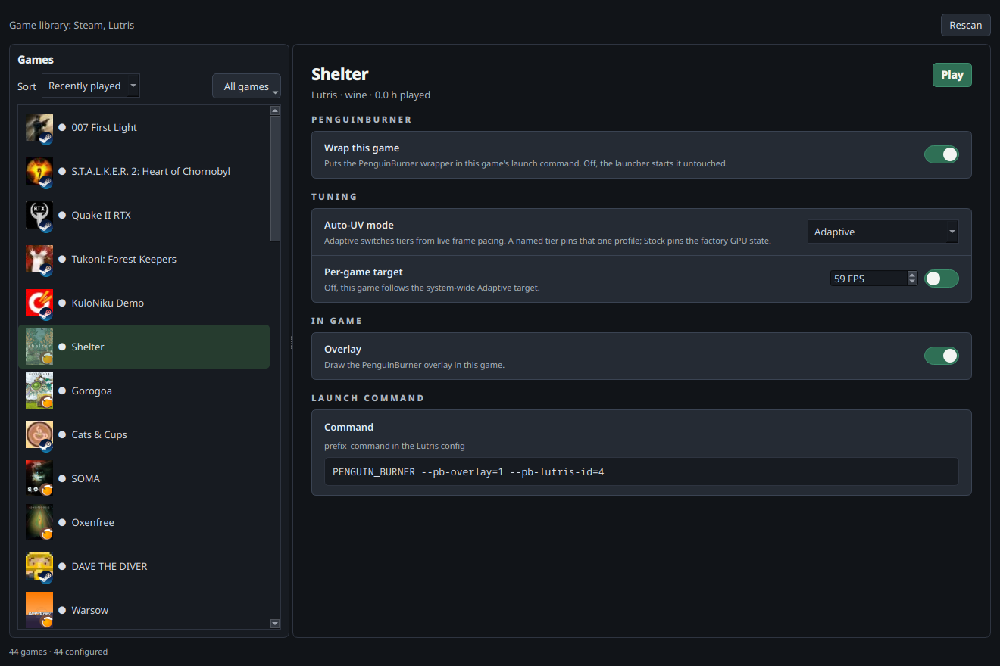

#  PenguinBurner — Automatic NVIDIA GPU Undervolting & Overclocking for Linux

<p align="center">
  <a href="https://pypi.org/project/penguin-burner/"></a>
  <a href="https://pypi.org/project/penguin-burner/"></a>
  
  
  <a href="LICENSE"></a>
  <a href="https://github.com/sponsors/jpietek"></a>
  <a href="https://github.com/jpietek/PenguinBurner/stargazers"></a>
</p>
<p align="center">
  
  
  
  
  <a href="https://pepy.tech/project/penguin-burner"></a>
</p>


PenguinBurner is an open-source NVIDIA GPU tuning app for Linux with
automatic undervolting, overclocking and adaptive per-game profiles for
**Steam and Lutris** in one [Game Library](#game-library).

**One scan. Three verified GPU profiles.**

- **Efficiency** — deepest savings. RTX 5080: 850 mV · 2800 MHz target /
  2625 MHz loaded · 254 W.
- **Balanced** — maintain more loaded clock. RTX 5080: 860 mV · 2775 MHz
  target / 2745 MHz loaded · 272 W.
- **Performance** — undervolt and overclock. RTX 5080: 925 mV · 2950 MHz
  target / 2977 MHz loaded · 313 W.

For scale: the same RTX 5080 at stock uses about **341 W** under the same load.
Balanced held roughly the same loaded clock at 272 W — about 69 W less.

Verified RTX 5080 examples; every GPU differs. Loaded clocks can fall below
the requested target under power or thermal limits.
Pre-optimized targets are included for RTX 30, 40, and 50 series cards.

## Install

```bash
python -m pip install --user --upgrade penguin-burner
```

If pip reports `externally-managed-environment`, use `pipx install penguin-burner`.
Native packages are also available for [Fedora (COPR)](https://copr.fedorainfracloud.org/coprs/jpietek/penguin-burner/),
[Arch / CachyOS (AUR)](https://aur.archlinux.org/packages/penguin-burner), and
[Ubuntu (PPA)](https://launchpad.net/~jpietek/+archive/ubuntu/penguin-burner).
See the [Install guide](docs/install.md) for prerequisites and commands.

[Flatpak](docs/flatpak.md) is available too. Native packages are recommended
because the GPU daemon, game wrappers, and Vulkan overlay run on the host.

PyPI, Flatpak with wrappers, COPR, AUR, and PPA installs run the GUI
as `penguin-burner` or `pburn`.

PenguinBurner installs its root hardware service once, with an admin prompt.
The GUI, CLI, and scans then use that service without further password prompts.

## Quick start

1. Install (above) with the NVIDIA driver and CUDA already set up.
2. Launch PenguinBurner (`penguin-burner` or `pburn`). Flatpak users without
   wrappers should use the [Flatpak guide](docs/flatpak.md).
3. Click **Setup Auto Undervolt**, choose a performance bias, and let the scan
   find and verify a stable curve. When it finishes, the verified profile is
   applied automatically.
4. In **Profiles**, select a profile and click **Apply**. Enable **Apply on
   startup** to use it at boot, or **Silent fan curve** for quieter cooling.
   **Restore defaults** returns the GPU to stock. See [profile management](docs/features/profile-management.md)
   for multi-GPU settings and other actions.
5. For per-game tuning — including **Adaptive**, which switches tiers as your
   frame rate changes — use **Game Library** to configure Steam and Lutris games.

## Automatic Undervolting & Overclocking

Auto-UV tests your GPU with a managed headless **Q2RTX** benchmark and **CUDA**
load. It finds stable settings, builds smooth V/F curves, and preserves the
exact tested curves through final verification and saving. Failed probes retry
safer settings; completed tiers remain available if a later tier fails.

Leave the GPU free of other demanding work during a scan so its stability and
FPS-per-watt measurements remain meaningful.


Choose **Efficiency**, **Balanced**, **Performance**, or **All tiers**.
All tiers produces a set for adaptive switching and reuses compatible scan work.

Every tier exposes voltage, clock, memory offset, and power limit in the same
order. **The defaults suit most GPUs; change them only if you understand GPU
tuning.** Fixed-power laptop GPUs use their stock limit automatically.


[Read the guide](docs/features/auto-uv.md)

[Algorithm and RTX 5080 verification](https://jpietek.github.io/PenguinBurner/auto-uv-cookbook/)
· [RTX 5070 Ti curve comparisons](https://jpietek.github.io/PenguinBurner/pr72-curve-comparison/)

## Adaptive Undervolting

PenguinBurner switches between saved tiers to meet your game's FPS target:
lower power when there is headroom, more performance when needed. It also
recognizes frame caps and idle periods so it can reduce power use.


[Read the guide](docs/features/adaptive-uv.md) — including
[advanced tuning](docs/features/adaptive-tuning.md).

## Game Library

Bring your **Steam and Lutris games together in one library**, with background
discovery, launcher badges, and sorting by launcher, name, recently played or
most played. Pick **Adaptive**, a fixed tier or **Stock** for each game;
PenguinBurner applies it at launch and restores your standing profile on exit.



Enable **Wrap this game**, then choose its GPU profile, Adaptive FPS target,
and overlay settings. Existing launch options and Lutris command prefixes are
preserved. Use **Play / Stop** to control a game or **All games** for bulk edits.

[Game Library guide](docs/features/game-library.md) · [Steam setup](docs/steam.md)
· [Lutris setup](docs/features/lutris.md)

Thanks to [@Ernold11](https://github.com/Ernold11) for the shared Game Library and
adaptive tuning improvements. **Which launcher should come next — Heroic?**
[Tell us in Discussions](https://github.com/jpietek/PenguinBurner/discussions).

## PenguinBurner vs LACT (NVIDIA)

[LACT](https://github.com/ilya-zlobintsev/LACT) is the broader, more established
Linux GPU app, and it landed a working Nvidia VF curve setter before we did. It
supports more brands and has deeper monitoring than we do. PenguinBurner is
narrower on purpose: automatic undervolting & overclocking, an in-game overlay,
and adaptive switching. NVIDIA-only comparison, to the best of our knowledge:

| Capability (NVIDIA) | PenguinBurner | LACT |
| --- | :---: | :---: |
| **Automatic** undervolt search (stability + perf verified) | ✅ Q2RTX + CUDA sweep | ❌ manual only |
| Rust hardware daemon | ✅ | ✅ |
| **Adaptive** undervolt (switches tiers by frame rate) | ✅ | ❌ |
| **In-game performance overlay** | ✅ | ❌ |
| **PC latency meter** | ✅ | ❌ |
| **Pre-frame-generation FPS counter** (base vs FG FPS) | ✅ | ❌ |
| Manual V/F curve editor | ✅ | ✅ |
| Fan curve control | ✅ auto silent curve + editor | ✅ custom curves |
| Power limit | ✅ Auto-UV + saved profiles | ✅ |
| Steam & Lutris game libraries | ✅ shared library with background discovery | ❌ |
| Per-game tuning profiles | ✅ per-game mode, adaptive FPS target, live launch | ❌ |
| Runtime profile switching | ✅ by present-frame FPS pacing | ✅ by running process / gamemode |
| MSI Afterburner import | ✅ | ❌ |
| Historical telemetry charts | 🚧 planned (live overlay today) | ✅ charts + CSV export |
| Detailed GPU info (VBIOS / VRAM / Vulkan / throttling) | ❌ tuning-focused | ✅ |
| Other GPU brands (AMD / Intel) | ❌ NVIDIA-native, for now | ✅ AMD · Intel · NVIDIA |
| systemd daemon · CLI / headless | ✅ · ✅ | ✅ · ✅ |

✅ available · ❌ not available · 🚧 planned/in progress

LACT monitors inside its own window (charts and CSV) and has no in-game overlay;
on Linux that is usually a separate tool like MangoHud. PenguinBurner's overlay
is built in.

The two interoperate via LACT export, so you can tune with PenguinBurner and run
the resulting curve under LACT if you prefer.

### Roadmap (planned, not yet shipped)

- **Historical data plotting** — power, clocks, and FPS over time.

## Performance Overlay

Show **base FPS**, **frame-generation FPS**, **PC latency**, GPU clocks,
power, temperatures, and the active tier while playing. Enable **Overlay** for
a game in Game Library and select fields in the Overlay tab. Latency requires
usable timing markers from the game.


[Overlay guide](docs/features/overlay.md) · [Latency and FPS details](docs/features/latency-fg.md)

## More features

- **[Profile management](docs/features/profile-management.md)** — apply, verify,
  tier, export, and clean up saved curves.
- **[Curve editors](docs/features/curve-editor.md)** — Afterburner-style manual
  V/F and fan curve editors with full keyboard control.
- **[Silent fan curve](docs/features/silent-fan-curve.md)** — auto-generated
  quiet fan curve once the undervolt brings temperatures down.

## MSI Afterburner Import

Bring your Windows [MSI Afterburner](https://www.msi.com/Landing/afterburner/graphics-cards)
profile over and import its V/F curve.


Point PenguinBurner at the real MSI Afterburner directory (no Afterburner
binaries or profiles are bundled in this repo). Default Windows path:

```text
C:\Program Files (x86)\MSI Afterburner
```

## LACT Export

Export any saved V/F (and optionally fan) curve as a complete Nvidia LACT config
from the Profiles view. See
[profile management](docs/features/profile-management.md#lact-export) for the workflow.

## Run At Your Own Risk

GPU tuning can crash the driver or freeze the system, even during verification.
Auto-UV records interrupted probes so later scans avoid the same unsafe region.
Performance adds overclocking and is optional.

Read about [recovery and crash history](docs/features/auto-uv-recovery.md)
before changing targets or clearing scan state.

## Acknowledgements

PenguinBurner was built through agentic AI development, guided by human ideas and
direction. The implementation, research, and reverse engineering were driven
primarily by **GPT 5.5** (OpenAI) and **Claude Opus** (Anthropic), recently
most of the codebase (new Rust daemon!) was rewritten with **Fable** (Anthropic).

- **NVIDIA** — for the graphics technology that, unfortunately, lacks some
  features and polish on Linux.
- **[Qt Project](https://www.qt.io/)** — for the excellent Qt6 UI.

Special thanks to the [LACT project](https://github.com/ilya-zlobintsev/LACT)
and Ilya Zlobintsev for pushing Linux NVIDIA tuning forward — in particular
[LACT #957 (Nvidia VF curve editor)](https://github.com/ilya-zlobintsev/LACT/pull/957),
merged April 18, 2026.

## Support

- [Sponsor the project](https://github.com/sponsors/jpietek)
- [Report a bug](https://github.com/jpietek/PenguinBurner/issues)

## CLI Documentation

See the command reference in [readme-cli.md](readme-cli.md).

## Start clean

See [resetting user data](docs/features/troubleshooting.md#resetting-user-data)
for a complete reset, or [scan recovery](docs/features/auto-uv-recovery.md) to
retry Auto-UV while preserving profiles and crash history.

Installing from a local checkout? See the [Install guide](docs/install.md#local-wheel-from-a-checkout).
